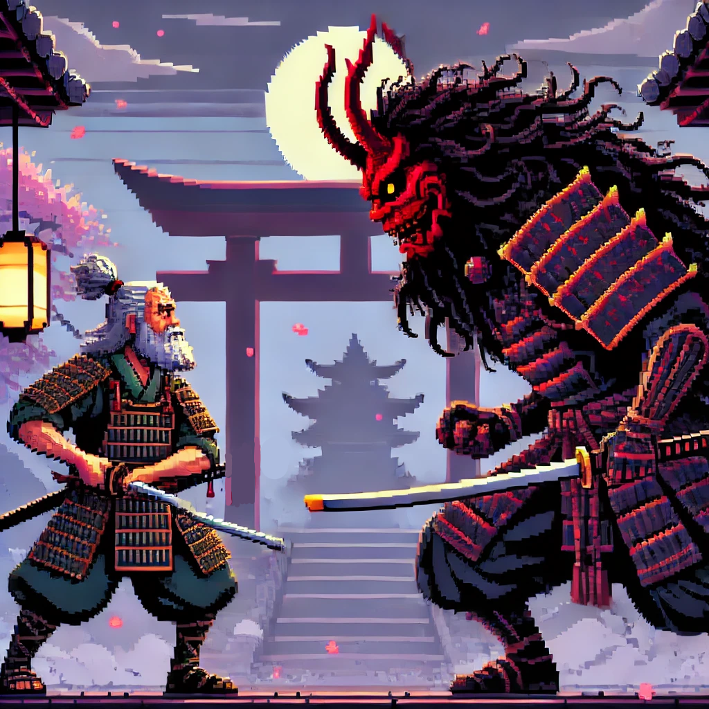

# 🎮 Boss Fight - Pygame Samuray Savaşı Oyunu 🎮



## 📜 Proje Hakkında

Boss Fight, Pygame kütüphanesi kullanılarak geliştirilmiş, samuray temalı bir 2D aksiyon oyunudur. Oyunda, samuray karakterinizi kontrol ederek güçlü bir boss ile mücadele ediyorsunuz. Oyun, Japon sanatından esinlenen görsel stilini, akıcı animasyonları ve zorlu boss savaşı mekanikleriyle birleştiriyor. 🏯⚔️

## ✨ Özellikler

- 🥋 **Samuray Karakteri**: Çeşitli saldırı ve hareket yeteneklerine sahip oyuncu karakteri
- 👹 **Boss Düşmanı**: İki farklı savaş fazına sahip, zorlu bir boss düşmanı
- 🏃 **Animasyonlar**: Yürüme, koşma, saldırı ve dash hareketleri için akıcı sprite animasyonları
- ⚔️ **Saldırı Sistemi**: Yakın dövüş saldırıları ve uzaktan saldırı (shuriken) mekanikleri
- 🔄 **Faz Sistemi**: Boss'un sağlığı azaldıkça değişen davranış ve saldırı kalıpları
- 🌸 **Görsel Efektler**: Sakura yaprakları ve dinamik arka plan ile Japon estetiği
- 🎵 **Ses Efektleri**: Menü ve savaş müzikleri

## 🎮 Kontroller

- 🔼 **W, A, S, D**: Karakteri hareket ettirme
- 👊 **F**: Yakın dövüş saldırısı
- 🌟 **V**: Shuriken fırlatma
- ⚡ **SHIFT**: Dash hareketi (hızlı kaçış)
- 🔍 **SPACE**: (Test amaçlı) Karaktere hasar verme

## 🛠️ Kurulum

### 📋 Gereksinimler

- 🐍 Python 3.x
- 🎲 Pygame kütüphanesi

### 📝 Adımlar

1. 📥 Repoyu klonlayın:
   ```
   git clone https://github.com/your-username/Pygame_project.git
   cd Pygame_project
   ```

2. 📦 Gerekli kütüphaneleri yükleyin:
   ```
   pip install pygame
   ```

3. 🚀 Oyunu başlatın:
   ```
   python firstGame.py
   ```

## 🎯 Oyun Mekanikleri

### 🥋 Karakter Özellikleri
- ❤️ **Sağlık**: 100 HP
- 🏃 **Hız**: 5 birim/frame
- ⚡ **Dash Hızı**: 15 birim/frame
- 💪 **Saldırı Gücü**: 20 hasar

### 👹 Boss Özellikleri
- ❤️ **Sağlık**: 100 HP
- 🔴 **Faz 1**: Temel saldırılar ve takip davranışı
- 🔥 **Faz 2**: Alev kılıcı, artan hız ve güçlendirilmiş saldırılar

### 🧠 Savaş Stratejisi
1. 👀 Boss'un saldırı kalıplarını öğrenin
2. 💨 Dash hareketini kullanarak saldırılardan kaçının
3. ⚔️ Yakın dövüş saldırıları ve shurikenler ile boss'a hasar verin
4. ⚠️ Faz 2'de boss'un artan hızına ve saldırı gücüne dikkat edin

## 🧩 Geliştirme

Bu proje, Pygame'in temel özelliklerini kullanarak geliştirilmiştir:
- 🎬 Sprite animasyonları
- 💥 Çarpışma tespiti
- 🎛️ Kullanıcı girişi işleme
- 🔊 Ses yönetimi
- 🧪 Fizik ve hareket sistemleri

## 🤝 Katkıda Bulunma

1. 🍴 Bu repoyu fork edin
2. 🌿 Yeni bir branch oluşturun (`git checkout -b feature/amazing-feature`)
3. 💾 Değişikliklerinizi commit edin (`git commit -m 'Add some amazing feature'`)
4. 📤 Branch'inize push edin (`git push origin feature/amazing-feature`)
5. 🔄 Pull Request açın

## 📄 Lisans

Bu proje [MIT Lisansı](LICENSE) altında lisanslanmıştır.

## 📞 İletişim

👨‍💻 Proje Sahibi - [GitHub Profiliniz](https://github.com/)

🔗 Proje Linki: [https://github.com/your-username/Pygame_project](https://github.com/your-username/Pygame_project)
